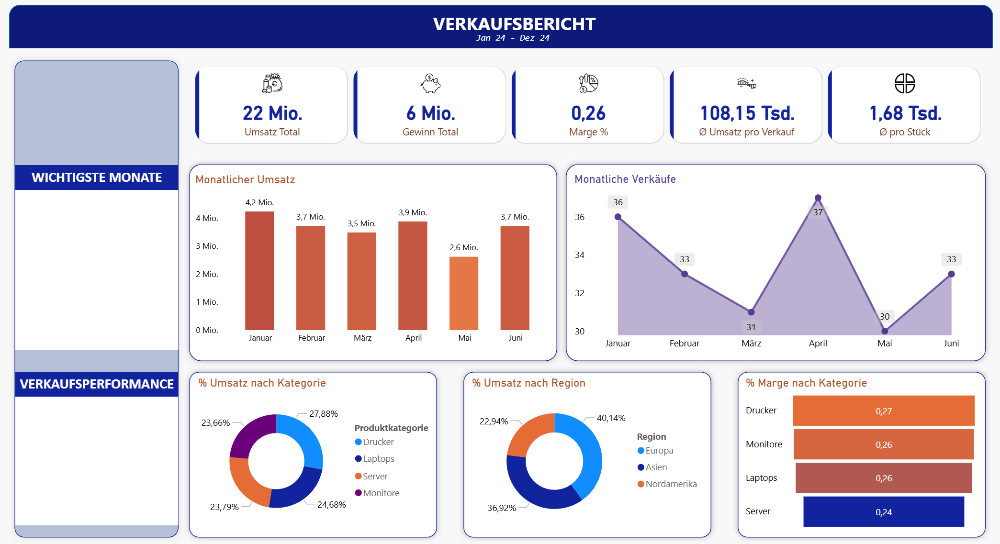
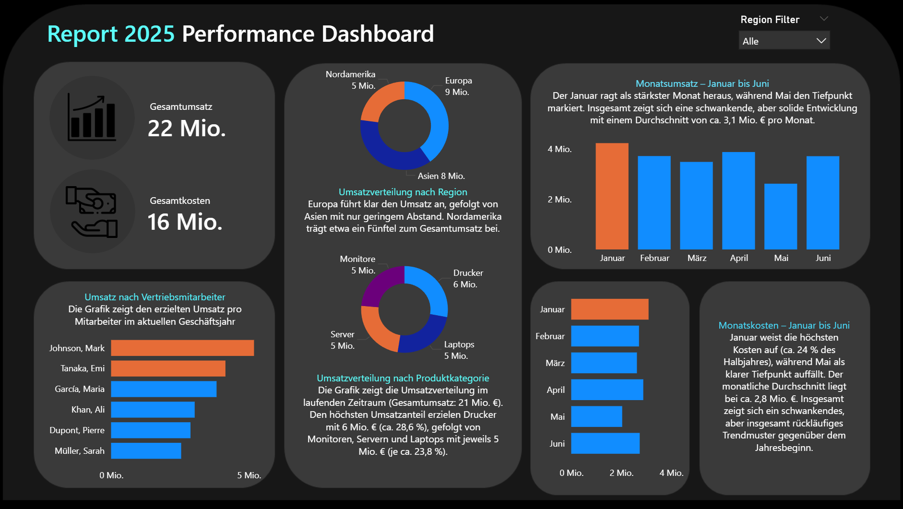

# Projekt 1: Verkaufs-Dashboard – IT-Hardware
**Januar 2024 – Juni 2024**

Ein interaktives Verkaufs-Dashboard zur Analyse des Jahresumsatzes bis Juni 2024 eines fiktiven IT-Hardware-Händlers.

  

## Über das Projekt

Dieses Dashboard ist mein erstes vollständiges Business-Intelligence-Projekt und dient als zentrales Portfolio-Stück, um meine Fähigkeiten in **Datenaufbereitung**, **Visualisierung** und **Storytelling mit Daten** zu zeigen.

Ziel war es, aus einer eher unstrukturierten Verkaufs-Rohdatenbasis (Transaktionen, Produkte, Regionen) ein **klares, übersichtliches und management-taugliches Dashboard** zu entwickeln, das die wichtigsten Fragen eines Geschäftsführers / Vertriebsleiters in wenigen Sekunden beantwortet.

## Wichtigste Erkenntnisfragen, die das Dashboard beantwortet

1. Wie hat sich der Umsatz und die Stückzahlen über das Jahr 2024 entwickelt?
2. Welche Monate waren die stärksten / schwächsten Verkaufsmonate?
3. Welche Produktkategorie bringt den meisten Umsatz und welcher den besten Gewinn/Marge?
4. Wie stark unterscheiden sich die Regionen (Europa, Asien, Nordamerika) in Umsatzanteil und Profitabilität?
5. Wie verhält sich die durchschnittliche Auftragshöhe und der durchschnittliche Stückpreis?
6. Gibt es auffällige Marge-Unterschiede zwischen den Produktkategorien?
7. Welche Kombination aus Kategorie + Region ist besonders lukrativ / problematisch?

## Wichtigste Kennzahlen (KPIs) auf einen Blick

- **Gesamtumsatz 2024**: 22,0 Mio. €
- **Gesamtgewinn**: 6,0 Mio. €
- **Durchschnittliche Marge**: 26,0 %
- **Durchschnittlicher Auftragswert**: 108.150 €
- **Durchschnittlicher Stückpreis**: 1.680 €

## Technologie-Stack

| Bereich               | Technologie/Tools                          
|-----------------------|--------------------------------------------
| Datenaufbereitung     | Python (Pandas), SQL                       
| Visualisierung        | Power BI     
| Versionskontrolle     | Git + GitHub                               
| Dokumentation         | Markdown                                   

## Erkenntnisse & Storytelling-Highlights

- Stärkster Monat: **Januar 2024** mit 4,2 Mio. € Umsatz
- Schwächster Monat: **Mai 2024** mit nur 2,6 Mio. € (starker Rückgang der Verkaufszahlen)
- **Drucker** sind mit Abstand umsatzstärkste Kategorie (27,9 %), aber auch margenstärkste (27 %)
- **Server** bringen zwar hohen Umsatzanteil (23,8 %), aber die niedrigste Marge (24 %)
- **Europa** dominiert klar mit **40 %** des Gesamtumsatzes
- Auffällig: Asien hat trotz geringerem Umsatzanteil (23 %) relativ gute Margen

## Nächste Schritte / geplante Erweiterungen

- Vergleich mit Vorjahr 2023 (fiktiv)
- Prognose-Funktion für 2025 (einfaches Trend-Modell)
- Detaillierte Kundenanalyse (ABC-Kunden, Wiederholungskäufer)
- Heatmap nach Land/Region
- Warnsystem bei kritischen Marge-Einbrüchen
- Automatische monatliche PDF-Reports per E-Mail
- Automatisierung der Spalten auf der linken Seite des Dashboardes

## Feedback sehr willkommen!

Da es mein erstes größeres Dashboard ist, freue ich mich riesig über konstruktives Feedback – egal ob zum Design, zur Story, zu den Kennzahlen oder zur technischen Umsetzung.

Vielen Dank fürs Anschauen!

# Projekt 2: 2025 Performance Dashboard – IT-Hardware Umsatz- & Kosten-Analyse

Modernes, interaktives Business-Intelligence-Dashboard zur Visualisierung von Umsatz-, Kosten- und Performancedaten eines fiktiven IT-Hardware-Unternehmens (Report 2025, Halbjahresdaten Jan–Jun).

  
*Gesamtansicht: KPI-Karten, regionale Donut-Charts, Produktkategorien, Top-Performer Mitarbeiter und monatliche Umsatz-/Kosten-Trends*

## Projekt-Highlights

- **Gesamtumsatz**: 22 Mio. €  
- **Gesamtkosten**: 16 Mio. €  
- **Erkennbare Insights**: Europa dominiert Umsatz, Drucker sind stärkste Produktkategorie, Januar ist Peak-Monat bei Umsatz & Kosten, Top-Performer generieren bis zu 5 Mio. €  
- **Dark-Theme Design** mit hohem Kontrast und konsistenter Farbcodierung (Orange = Umsatz, Blau = Kosten)

## Verwendete Technologien & Tools

| Bereich              | Technologie/Tool          | Verwendung / Beitrag                                                                 |
|----------------------|---------------------------|--------------------------------------------------------------------------------------|
| Datenaufbereitung    | **Python**                | Daten-Generierung, Bereinigung, Aggregation, Berechnung von Prozentanteilen & KPIs   |
| Datenquelle / Query  | **SQL**                   | Strukturierte Abfragen für monatliche Summen, Gruppierungen nach Region/Kategorie/Mitarbeiter |
| Visual Design        | **Microsoft PowerPoint**  | Erstellung des Layout-Konzepts, Farbschema, Mockup-Design und finale Grafik-Elemente (Export als PNG/SVG) |
| Dashboard-Entwicklung| **Microsoft Power BI**    | Interaktives Dashboard mit Donut-Charts, Balkendiagrammen, KPI-Karten, Region-Filter und Tooltips |
| Deployment           | GitHub Pages / Static Export | Hosting des finalen Dashboards als interaktive Web-Ansicht (Power BI Publish to Web oder Embedded) |

## Warum diese Kombination?

- **Python + SQL** → Realistische Datenpipeline simulieren (ETL-ähnlich)  
- **PowerPoint** → Professionelles, pixelgenaues Design und Storytelling-Layout (ideal für Präsentationen & Portfolio)  
- **Power BI** → Schnelle Erstellung interaktiver, filterbarer Visuals mit nativem Business-Intelligence-Look & Feel  

Das Projekt zeigt damit sehr gut einen **kompletten BI-Workflow**: von der Datenbasis (Python/SQL) über Design (PowerPoint) bis hin zur interaktiven Präsentation (Power BI).

### Nächste Schritte / Erweiterungen (geplant)

- [ ] Vollständiges SQL-Datenmodell (Star-Schema)  
- [ ] DAX-Maße für erweiterte KPIs (z. B. Marge %, YoY-Vergleich)  
- [ ] Power BI Custom Visuals oder R/Python-Skripte im Dashboard  
- [ ] Light-/Dark-Mode Toggle  
- [ ] Export-Funktion (PDF/Excel)
